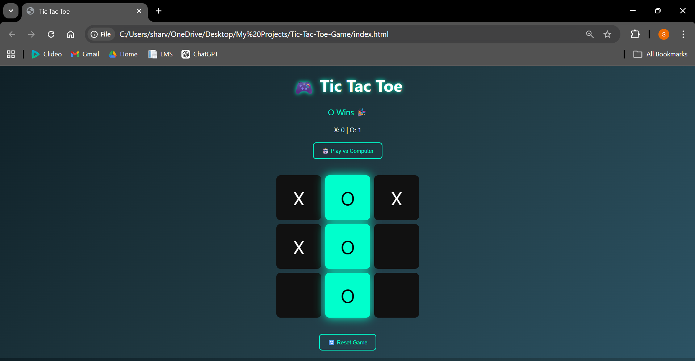

# 🎮 Tic Tac Toe Game

A modern and interactive Tic Tac Toe game built using HTML, CSS, and JavaScript.

---

## 🚀 Live Demo

👉 https://sharvischavan-max.github.io/tic-tac-toe-game/

---

## ✨ Features

* 🧠 Smart AI opponent (Play vs Computer)
* 👥 Two-player mode
* 🎯 Winner detection with highlight animation
* 🎨 Modern neon UI design
* 🔄 Reset functionality
* 📊 Score tracking system

---

## 🛠️ Technologies Used

* HTML
* CSS
* JavaScript

---

## 📸 Screenshot

---

## 📌 How to Run Locally

1. Download or clone this repository
2. Open `index.html` in your browser

---

## 👩‍💻 Author

Sharvi Chavan
